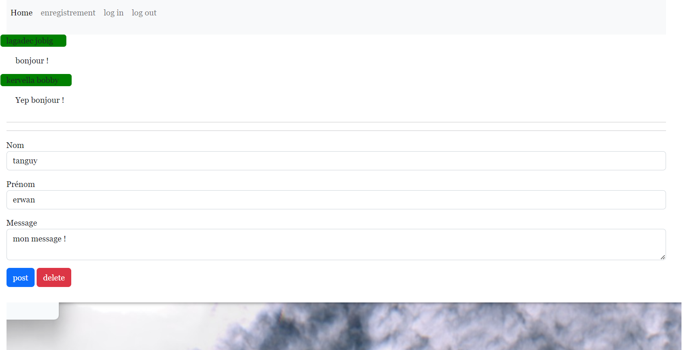

# appli nodeJs avec Express, ejs et mysql 

Une partie authentification (enregistrement utilisateur, connection), et une partie 'blog' minimaliste, avec des simples mises en pages bootstrap. Un peu d'ajax.   

  


## base de données :   

Pour uniquement la base de données, commenter le service node dans le docker-compose. 
La base de données est basée sur une image docker mysql 8.
Le dossier mysql est à créer avant d'exécuter la commande 

``` bash
docker-compose up -d --build
``` 

## npm :  

Si le service node du docker-compose est commenté : 

```bash
npm init  
nodemon index.js
```
L'application est disponible en localhost, port 8080.   

## tout containeurisé : 

``` bash
docker-compose up -d --build
``` 
L'application est disponible en localhost, port 8888.   


